

 # TechBlog
================

A Java-based web application for tech enthusiasts to share and discuss their knowledge.

## Overview
------------

TechBlog is a web application built using Java servlets. It allows users to create and share posts on various tech-related topics. The application features user registration, login, profile management, post creation, and deletion.

## Features
------------

* User registration and login
* Profile management
* Post-creation, editing, and deletion
* Category-based post organization

## Technologies Used
--------------------

* Java 17
* Servlets
* Apache Tomcat
* MySQL
* HTML/CSS/JavaScript
* Bootstrap

## Requirements
---------------

* Java 17 or higher
* Apache Tomcat 9 or higher
* MySQL 5.7 or higher

## Installation
------------

1. Clone the repository: `git clone https://github.com/your-username/techblog.git`
2. Build the project using Maven: `mvn clean package`
3. Deploy the WAR file to Apache Tomcat
4. Configure the database connection in the `com/techblog/repositories/ConnectionProvider.java` file
5. If you are working with IntelliJ IDEA, you can run the application using smart Tomcat
6. Download the smart tomcat plugin from Intellij plugins, running the application would be much easier

## Running the Application
-------------------------

1. Start Apache Tomcat: `catalina.sh run`
2. Access the application in your web browser: `http://localhost:8080/techblog`

## About the application

The main application starts with an index page

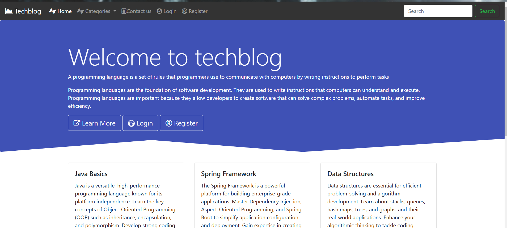

You can go to the register module if you are a new user and register

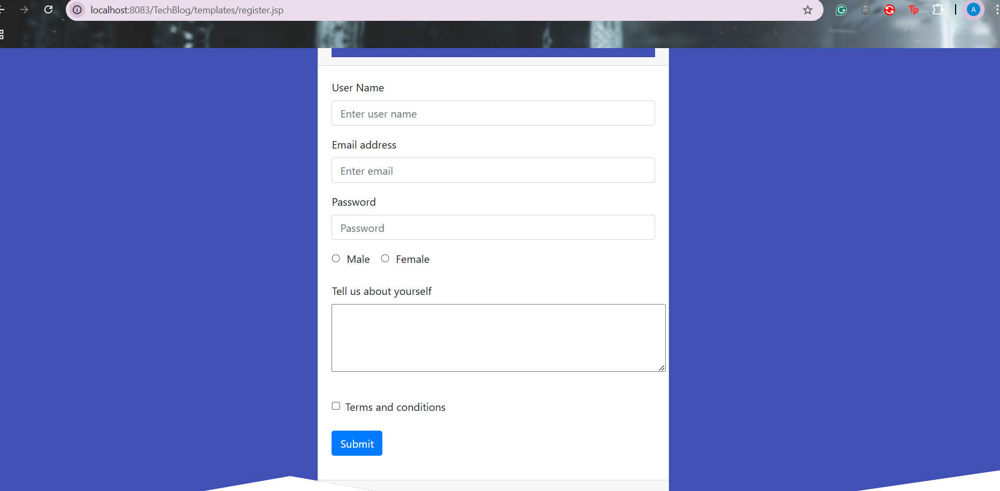

After registering/ or not registering if you are an existing user you can log in here
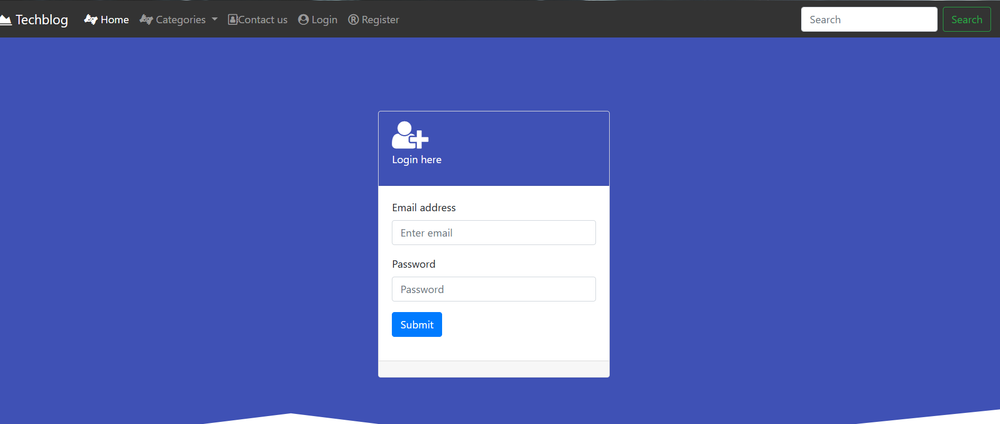

Once you are logged in you will be redirected to the landing screen
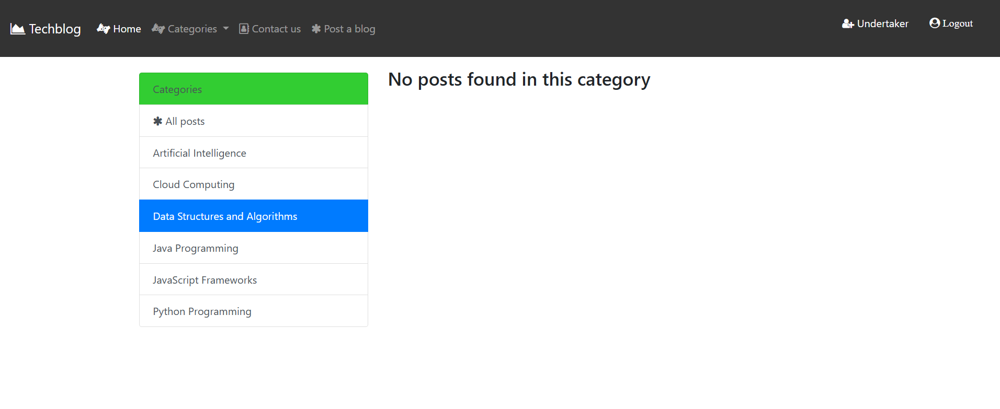

From here you can create a post by clicking on Post a blog button in the navbar

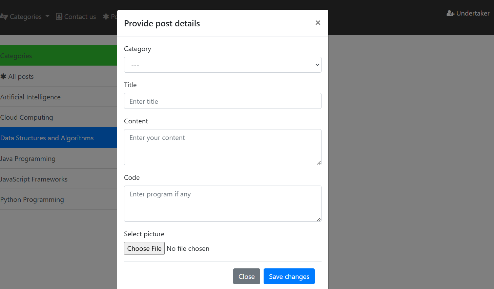
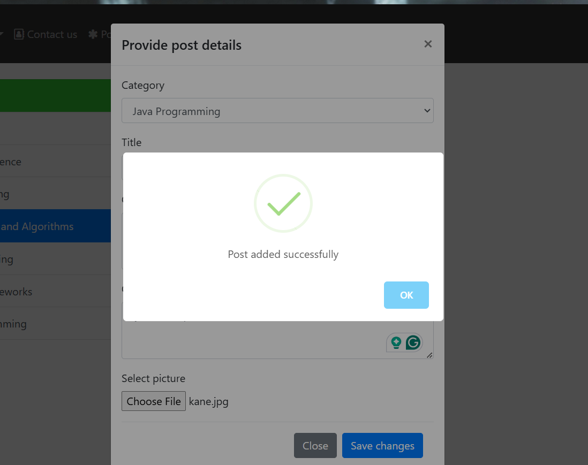

You can like the post
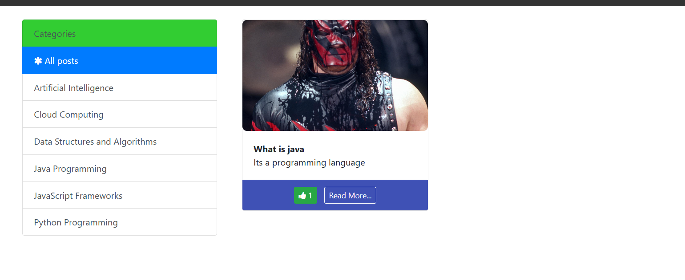

Posts can be filtered with the categories in the sidebar
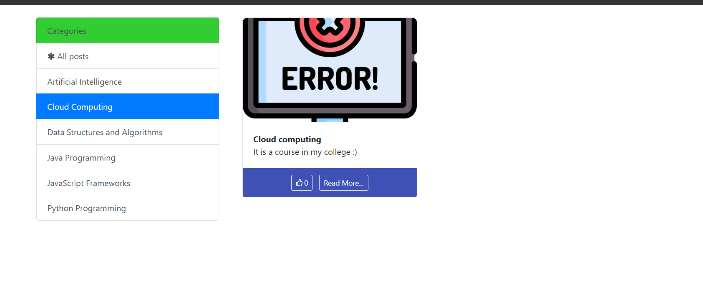

You can view more details of the post by clicking read more
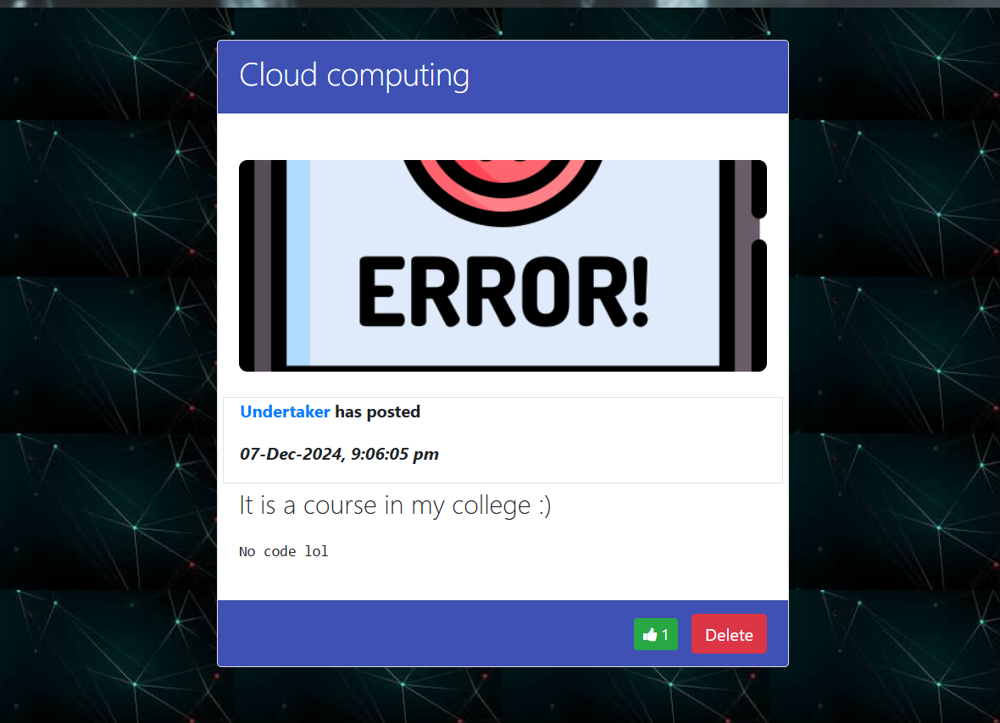

You can also delete your post, you can't delete other users' posts

You can view your profile details by clicking on your name on the navbar
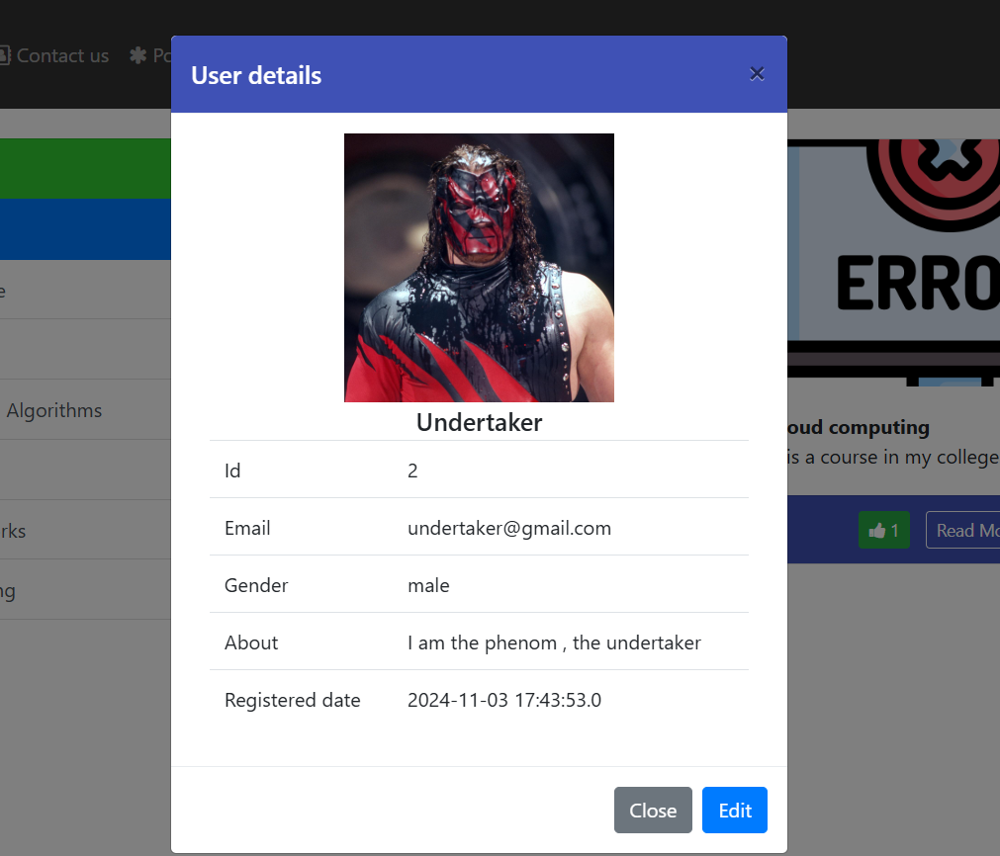

If you want to you can edit your details
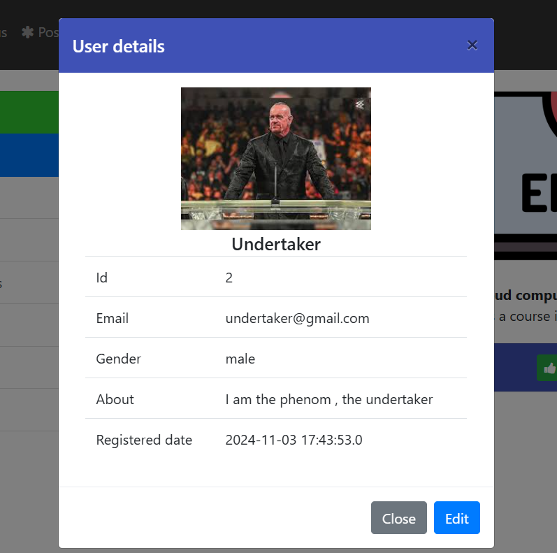

Please let me know if you have any questions or feedback. Thank you for using TechBlog!

